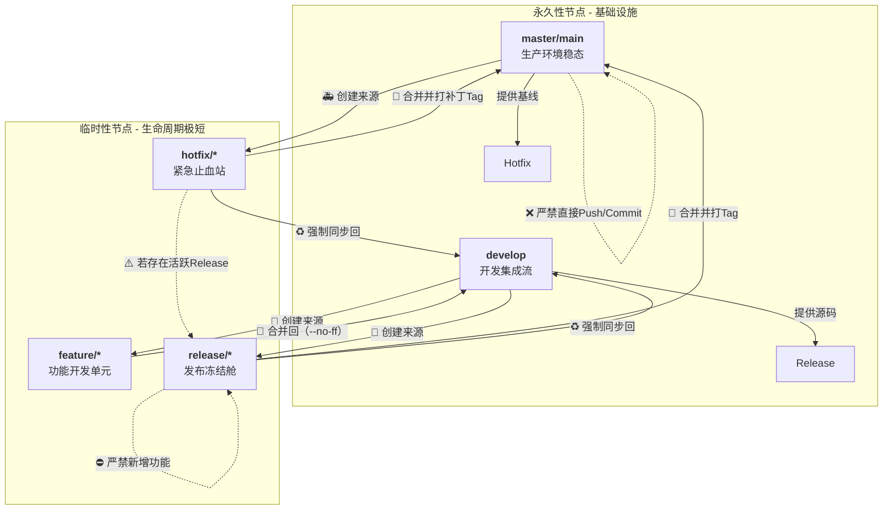

将Git Flow转化为**知识图谱（Knowledge Graph）**，意味着我们不再只看“代码怎么流”，而是聚焦于**实体（节点）**、**属性（职责）**和**关系（约束与动作）**。

下面这份图谱设计，我把它拆解为**可视化结构图**和**实体属性详情表**，可以直接放入你的架构设计文档中。

---

### 1. 知识图谱可视化（Mermaid 格式）

这张图不仅展示了分支流向，还标注了**节点类型（长期/临时）**、**核心职责**和**关键禁令**，一眼看清全貌：



---

### 2. 各节点详细职责清单（实体属性表）

这是知识图谱的**“实体数据字典”**，开发者和PM只看这张表就能对齐所有认知：

| 节点实体 | 图谱类型 | 生命周期 | 核心职责（做什么） | 绝对红线（禁做什么） | 产出物（给下游） |
| :--- | :--- | :--- | :--- | :--- | :--- |
| **`master`** | **根节点（Root）** | **永久** | 1. 存放线上已发布的**不可变历史**<br>2. 每一个`commit`对应一个精确的**生产版本**<br>3. 作为`hotfix`的唯一基线来源 | **❌ 直接提交代码**<br>**❌ 执行`git push --force`** | **Git Tag**（如 `v1.2.0`）<br>生产环境部署包 |
| **`develop`** | **集成枢纽（Hub）** | **永久** | 1. 汇总所有`feature`的最终成果<br>2. 代表**下一个发版周期**的最新代码全貌<br>3. 唯一允许**轻度不稳定**的主干 | **❌ 直接开发业务代码**（需通过feature流入）<br>**❌ 直接合并`master`**（需经过release） | 下一版本的**基础源码包** |
| **`feature/*`** | **工作单元（Worker）** | **极短（天/小时）** | 1. 承载**单一业务功能**或**技术债重构**<br>2. 开发者在此进行所有日常编码提交 | **❌ 合并其他`feature`分支**<br>**❌ 引入与当前功能无关的改动** | 功能代码块（Diff） |
| **`release/*`** | **质量闸门（Gate）** | **短（周/天）** | 1. **封板冻结**，只修Bug、改配置、更新文档<br>2. 为上线做最后的**回归测试**与**性能验证**<br>3. 在此处更新版本号元数据（`CHANGELOG.md`） | **⛔ 新增任何业务功能**<br>**⛔ 大规模重构底层架构** | **候选发布包**（如 `v1.2.0-rc.1`）<br>测试报告 |
| **`hotfix/*`** | **急救中心（ER）** | **极短（小时）** | 1. 绕过`develop`长周期，**直接修复线上致命缺陷**<br>2. 必须保持改动范围**极度收敛** | **❌ 修复非本次故障的周边代码**<br>**❌ 进行依赖包大版本升级** | **补丁包**（如 `v1.2.1-hotfix`） |

---

### 3. 核心关系（边）的约束逻辑

图谱的灵魂在于“边”的规则。这里定义了节点间的**交互协议**：

| 关系起点 | 关系终点 | 关系类型（动作） | **强制约束条件** |
| :--- | :--- | :--- | :--- |
| `develop` | `feature/*` | **派生（Derive）** | 必须从 `develop` **最新提交**切出，确保基线最新。 |
| `feature/*` | `develop` | **合并（Merge）** | 必须走 **PR/MR**，必须使用 `--no-ff`，至少1名审批人。 |
| `develop` | `release/*` | **派生（Derive）** | 选取`develop`上**稳定的时间节点**（如冲刺结束日）切出。 |
| `release/*` | `master` | **晋升（Promote）** | 必须**通过全部测试用例**，合并后**必须打Git Tag**。 |
| `release/*` | `develop` | **回写（Backport）** | **必须执行**（保证Bug修复不丢失），遇到冲突强制以`release`为准。 |
| `master` | `hotfix/*` | **派生（Derive）** | 必须从**线上最新的Tag**处切出，确保修复基于生产环境。 |
| `hotfix/*` | `master` | **晋升（Promote）** | 验证通过后合并，**必须打补丁Tag**（升Patch号）。 |
| `hotfix/*` | `develop`（及活跃的`release`） | **回写（Backport）** | **强制双写**，少合并一个下游分支都算流程违规。 |

---

### 4. 图谱的“动态监控规则”（给架构师看）

有了这张知识图谱，你可以设立三个**监控指标**来衡量团队是否遵守图谱：

1.  **节点寿命预警**：如果`release/*`分支存活超过 **5个工作日**，图谱自动告警（表示发版阻塞，需介入）。
2.  **孤立节点检测**：如果存在`feature/*`分支超过 **3天** 未向`develop`发起PR，图谱标记为“僵尸分支”，提醒清理。
3.  **回写完整性校验**：每次`master`更新后，脚本自动检查`develop`（和活跃`release`）是否包含相同`commit hash`，若不包含则阻断下一次构建。

---

这张图谱现在已经是一个**可度量的状态机**了。接下来，你是希望我把这张图谱**直接转换成 Git 钩子脚本（pre-commit/pre-push）**，让本地客户端自动拦截违规操作？还是想把它**生成一张 SVG 图片**，挂在你团队的 Confluence/Wiki 首页当作战地图？告诉我你的落地场景，我帮你把图谱“活”起来。😎


这份文档的**结构框架**我已经在脑海中搭建好了。为了不让它沦为一张挂在墙上的“装饰画”，我决定把它写成一份**可执行的状态机文档**——开发者看一眼就知道当前在哪个节点、该敲什么命令、门禁在哪。

在正式输出文档之前，作为“评审员”，我认为必须补充进文档的**4个实战缺失项**（否则这份模板依然会有歧义）：

1. **分支命名规范（正则约束）**：必须明确 `feature/*`、`release/*`、`hotfix/*` 的命名规则（如 `feature/JIRA-123-login`），否则CI解析器会崩溃。
2. **合并策略（保留历史还是压扁）**：明确哪个节点必须用 `--no-ff`（保留合并轨迹），哪个节点可以用 `squash`（压缩脏提交）。
3. **清理策略（分支生命周期）**：合并完成后，谁负责删除远端分支？是MR自动删还是人工删？
4. **紧急中止策略**：如果 `release` 测试发现重大缺陷决定取消发布，分支该如何处理（直接删除还是回退）？

---

基于以上补全，我为你输出了这份可直接放入项目根目录的 **`GIT_WORKFLOW_TEMPLATE.md`** 标准文档：

---

# 项目Git分支管理标准流程（状态机模板） v1.0

> **适用场景**：定期发版（周/月）的中大型项目 | **核心原则**：`master` 永不稳定，`develop` 汇总一切，`release` 只修不增，`hotfix` 急诊优先。

---

## 1. 节点总览（一眼看清当前进度）

| 当前所在分支 | 代表项目阶段 | 开发者可做之事 | **严禁操作** |
| :--- | :--- | :--- | :--- |
| **`master` (main)** | **生产环境（稳态）** | 仅限查看与紧急拉取 `hotfix` 基线 | **直接 `git push`、`git commit`** |
| **`develop`** | **下一版本开发集成（动态）** | 合并 `feature/*`；切出 `release/*` | **直接改业务代码；直接合并 `master`** |
| **`feature/*`** | **具体功能点开发（进行中）** | 日常编码、本地提交、推送远端备份 | **合并其他 `feature`；合并 `develop`（需提PR）** |
| **`release/*`** | **上线前冻结测试（封板）** | 修Bug、改配置文件、更新文档 | **新增业务功能、重构代码** |
| **`hotfix/*`** | **线上紧急止损（急诊）** | 修复线上特定缺陷 | **改动非Bug相关业务逻辑** |

---

## 2. 节点生命周期与合并路径（状态机流转）

### 🟢 节点 A：功能开发（Feature -> Develop）
- **起始动作**：从 `develop` 最新代码切出 `feature/功能名`
- **完工标志**：自测通过，Code Review 完成
- **合并动作**：
  - 向 `develop` 发起 **Pull Request (PR)** / Merge Request
  - **合并策略**：必须使用 `--no-ff`（保留功能分支的合并轨迹，严禁 `Fast-forward`）
- **清理**：合并后，**自动/手动删除远端 `feature` 分支**（本地可保留）

### 🔵 节点 B：发版冻结（Release -> Master & Develop）
- **起始动作**：达到发版节点时，从 `develop` **当前最新代码**切出 `release/v{x.y.z}`
- **测试期约束**：
  - 测试人员在 `release` 上提Bug单，开发人员**只在此分支修Bug**
  - **若此时 `develop` 有新的功能合并，无需同步到 `release`**（避免引入新风险）
- **完工标志**：测试通过，确认上线
- **合并动作（两步走，顺序重要）**：
  1. **第一步**：合并 `release` 到 `master`，并在 `master` 上打 Tag `v{x.y.z}`（触发生产部署）
  2. **第二步**：**立即**合并 `release` 回 `develop`（保证修复的Bug同步到未来版本）
- **清理**：删除远端 `release` 分支

### 🔴 节点 C：紧急止血（Hotfix -> Master & Develop & Active Release）
- **起始动作**：从 `master` 当前 **线上Tag** 切出 `hotfix/紧急描述`
- **修复期约束**：禁止大范围改动架构，只改引起故障的代码
- **完工标志**：验证通过，回归完成
- **合并动作（三步走，极其关键）**：
  1. **第一步**：合并 `hotfix` 到 `master`，打补丁Tag `v{x.y.z+1}`
  2. **第二步**：合并 `hotfix` 回 `develop`
  3. **第三步（关键补充）**：**若当前有活跃的 `release/*` 正在测试**，必须**同步合并**到该活跃 `release` 分支（防止下个版本丢代码）
- **清理**：删除远端 `hotfix` 分支

---

## 3. 红线禁区（Commit & Push 绝对禁令）

| 禁令编号 | 具体内容 | 违规后果 |
| :--- | :--- | :--- |
| **R-01** | **禁止** 向 `master` 直接 `push` 或 `merge`（必须通过PR且经审批） | 触发流水线熔断，回退并追责 |
| **R-02** | **禁止** 在 `release/*` 分支上增加 `feat:` 类别的提交 | 流水线自动拦截，拒绝合并 |
| **R-03** | **禁止** 强制推送 (`git push --force`) 到 `develop`、`release`、`master` | 覆盖他人历史，**全团队禁止** |
| **R-04** | **禁止** 将 `develop` 直接合并进 `master`（必须经 `release` 过渡） | 失去版本管控和测试缓冲带 |

---

## 4. CI/CD 自动化触发的硬性约定（机器视角）

为了让流水线识别，**分支命名必须符合正则**：

| 分支类型 | 命名正则（示例） | 触发CI动作 |
| :--- | :--- | :--- |
| `feature/*` | `feature/feat-*` 或 `feature/JIRA-*` | 仅构建单元测试 + 代码扫描 |
| `release/*` | `release/v[0-9]+.[0-9]+.[0-9]+` | 全量构建 + 部署预发布环境 |
| `hotfix/*` | `hotfix/v[0-9]+.[0-9]+.[0-9]+-hotfix` | 全量构建 + 紧急部署预备 |
| `master` | 精确匹配 `master` | 自动打Tag + 部署生产环境 |

---

## 5. 常规操作命令速查（拷贝即用）

```bash
# 1. 开始一个新功能
git checkout develop && git pull
git checkout -b feature/JIRA-9527-add-login
# ... 开发提交若干次 ...

# 2. 功能完工合并（提PR，远端自动处理，本地仅做参考）
git checkout develop && git pull
git merge --no-ff feature/JIRA-9527-add-login -m "Merge feature: 登录模块完成"

# 3. 发起发版
git checkout -b release/v1.2.0 develop
# ... 修复测试Bug并提交 ...

# 4. 发版合入（两步走）
git checkout master && git pull
git merge --no-ff release/v1.2.0 -m "Release v1.2.0"
git tag -a v1.2.0 -m "Release version 1.2.0"
git push origin master --tags

git checkout develop && git pull
git merge --no-ff release/v1.2.0 -m "Sync release v1.2.0 back to develop"
git push origin develop

# 5. 紧急热修复
git checkout master && git pull
git checkout -b hotfix/fix-npe
# ... 修复 ...
git checkout master && git merge --no-ff hotfix/fix-npe -m "Hotfix: 修复空指针"
git tag -a v1.2.1 -m "Hotfix version 1.2.1"
# 注意：千万记得合并回 develop（以及活跃的release）
git checkout develop && git merge --no-ff hotfix/fix-npe
```

---

## 6. 异常场景标准处置（FAQ）

- **Q：`release` 测试了3天，`develop` 已经合并了别人很多新功能，合并回 `develop` 冲突极大怎么办？**
  - **A**：切勿硬解大冲突。在 `release` 生命周期内，**建议每天上班将 `release` 主动合并进 `develop` 一次**（增量同步），把大冲突化小。
- **Q：如果 `release` 被测试出重大架构缺陷，决定本次取消发布，分支怎么办？**
  - **A**：**直接删除远端 `release` 分支**（`git push origin --delete release/v1.2.0`）。**严禁**将其合并进 `master` 或 `develop`，因为这相当于把半成品污染了主干。
- **Q：`hotfix` 合并进 `release` 时，会不会导致 `release` 带上紧急代码而影响发版进度？**
  - **A**：不会。`hotfix` 本身是线上已验过的代码，合并进 `release` 只会让下个版本更稳定，必须执行。

---

### 文档后续迭代建议

这份模板目前是**标准Git Flow**的纯净版。当你的微服务数量超过 **10个**，或者发布频率变成 **一天多次** 时，这份文档就需要“瘦身”——届时我可以帮你裁掉 `develop` 分支，演化为 **GitHub Flow（单主干+Feature Toggle）** 的轻量模板。

最后确认一下：你们项目的**版本号规则**是严格遵循 `主版本.次版本.补丁`（如 `1.2.0`）吗？如果是，我会把这个规则写进 CI 脚本的 `versioning` 章节里；如果不是，我再帮你调整 Tag 的生成逻辑。😊

好的！版本号规则写入脚本后，这份文档就从**“指导手册”**升级成了**“半自动化引擎”**。

我为你写了一套 **Shell 脚本（兼容 Linux/macOS/Git Bash）**，它完全遵循 **SemVer 2.0（语义化版本）** 规范，并能根据你当前所在的分支节点，**自动推导**出该给项目打上什么版本号。

这套脚本可以直接接入你的 CI/CD（如 GitHub Actions、GitLab CI、Jenkins）的 `$VERSION` 环境变量中。

---

### 1. 版本号核心规则（写在脚本里的逻辑）

| 当前所在节点 | 版本号来源规则 | 输出示例 |
| :--- | :--- | :--- |
| **`master` (生产)** | 读取 **最新 Git Tag**（如 `v1.2.3`），原样输出 | `1.2.3` |
| **`develop` (开发集成)** | 读取最新 Tag，**自动升「次版本号」**，并加 `-SNAPSHOT` 后缀 | `1.3.0-SNAPSHOT` |
| **`release/v*` (发版冻结)** | **直接提取分支名**中的版本号（`v1.2.0`），并加 `-rc` 候选后缀 | `1.2.0-rc.1` |
| **`hotfix/*` (紧急修复)** | 读取最新 Tag，**自动升「补丁版本号」**，并加 `-hotfix` 后缀 | `1.2.4-hotfix` |

---

### 2. 可执行脚本文件 `git-version.sh`

请将以下代码保存到项目根目录，并赋予执行权限 `chmod +x git-version.sh`。

```bash
#!/bin/bash
# ============================================================
# 文件名：git-version.sh
# 功能：基于 Git Flow 节点自动生成语义化版本号 (SemVer 2.0)
# 用法：./git-version.sh  (输出纯版本号，供CI变量赋值)
# ============================================================

set -e

# ---------- 1. 获取当前分支名 ----------
BRANCH=$(git symbolic-ref --short HEAD 2>/dev/null)
if [ -z "$BRANCH" ]; then
    echo "ERROR: 不在任何分支上（detached HEAD 状态），请切回分支" >&2
    exit 1
fi

# ---------- 2. 获取最新的符合规范的 Tag ----------
# 匹配 v1.2.3 格式，按版本号排序取最新
LATEST_TAG=$(git describe --tags --match "v[0-9]*" --abbrev=0 2>/dev/null || echo "v0.0.0")
LATEST_VERSION=${LATEST_TAG#v}  # 去掉前缀 'v'

# 拆解版本号：主版本.次版本.补丁
IFS='.' read -r MAJOR MINOR PATCH <<< "$LATEST_VERSION"
# 如果拆解失败（比如含有-rc后缀），强制按基础数值处理
if ! [[ "$MAJOR" =~ ^[0-9]+$ ]] || ! [[ "$MINOR" =~ ^[0-9]+$ ]] || ! [[ "$PATCH" =~ ^[0-9]+$ ]]; then
    echo "WARN: 最新 Tag ($LATEST_TAG) 格式异常，重置为 0.0.0" >&2
    MAJOR=0; MINOR=0; PATCH=0
fi

# ---------- 3. 核心逻辑：根据不同节点计算版本号 ----------
case "$BRANCH" in
    master|main)
        # 生产节点：直接返回最新 Tag 的纯净数字
        VERSION="$MAJOR.$MINOR.$PATCH"
        ;;

    develop)
        # 开发节点：次版本号+1，补丁归零，加 SNAPSHOT
        NEXT_MINOR=$((MINOR + 1))
        VERSION="$MAJOR.$NEXT_MINOR.0-SNAPSHOT"
        ;;

    release/*)
        # 发版节点：提取分支名中的版本 (如 release/v1.2.0 -> 1.2.0)
        RELEASE_VER=$(echo "$BRANCH" | sed -n 's/^release\/v\([0-9]*\.[0-9]*\.[0-9]*\)$/\1/p')
        if [ -z "$RELEASE_VER" ]; then
            echo "ERROR: release 分支命名必须为 release/vX.Y.Z (如 release/v1.2.0)" >&2
            exit 1
        fi
        # 尝试读取已存在的 release 候选计数（防止同版本多次构建覆盖rc）
        # 若本地已有 v1.2.0-rc.1，则自动递增为 rc.2
        EXISTING_RC=$(git tag -l "v${RELEASE_VER}-rc.*" | wc -l)
        RC_NUM=$((EXISTING_RC + 1))
        VERSION="$RELEASE_VER-rc.$RC_NUM"
        ;;

    hotfix/*)
        # 热修复节点：补丁版本号+1，加 hotfix 后缀
        NEXT_PATCH=$((PATCH + 1))
        VERSION="$MAJOR.$MINOR.$NEXT_PATCH-hotfix"
        ;;

    *)
        # 其他未知分支（如 feature/*）：沿用 develop 逻辑，便于测试
        echo "WARN: 未知分支 '$BRANCH'，按 develop 规则处理（SNAPSHOT）" >&2
        NEXT_MINOR=$((MINOR + 1))
        VERSION="$MAJOR.$NEXT_MINOR.0-SNAPSHOT"
        ;;
esac

# ---------- 4. 输出最终版本号 ----------
# 只输出纯版本号，供 CI 赋值 (如 export VERSION=$(./git-version.sh))
echo "$VERSION"
```

---

### 3. 如何集成到 CI/CD 流水线（脚本用法）

#### 方式 A：在 GitHub Actions 中注入环境变量
```yaml
- name: 自动生成版本号
  id: versioning
  run: |
    VERSION=$(bash ./git-version.sh)
    echo "VERSION=$VERSION" >> $GITHUB_ENV
    echo "生成的版本号为: $VERSION"

- name: 构建 Docker 镜像
  run: docker build -t myapp:${{ env.VERSION }} .
```

#### 方式 B：在 Maven / Gradle 中自动修改项目版本
结合 `mvn versions:set`，让 `pom.xml` 永远与 Git 状态对齐：
```bash
# 在 CI 任务中执行
VERSION=$(./git-version.sh)
mvn versions:set -DnewVersion=$VERSION -DgenerateBackupPoms=false
mvn clean deploy
```

---

### 4. 补充进文档的“打标签”铁律（脚本配套约束）

为了让上述脚本**永远不出错**，必须在文档中新增两条强制规范：

| 规则编号 | 内容 | 校验方式 |
| :--- | :--- | :--- |
| **TAG-01** | 只有 `master` 分支合并完成后，才允许**手动/自动**打 Tag。**禁止**在 `develop`、`release`、`hotfix` 上打正式 Tag（`vX.Y.Z`）。 | 在 CI 中判断：若当前分支不是 `master` 且试图 `git tag`，直接报错退出。 |
| **TAG-02** | 所有 Tag 必须遵循 `v主.次.补丁` 格式（**不带后缀**）。`-rc` 和 `-hotfix` 只是构建过程中的**临时标识**，合并进 `master` 后必须剥掉。 | 人工 Code Review 检查 Tag 名。 |

---

### 5. 演练一遍：这份脚本如何“驱动”你的节点流转

假设你的仓库目前最新 Tag 是 `v1.1.0`：

| 你执行的操作 | 当前分支 | 执行 `./git-version.sh` 输出 | 脚本背后的逻辑 |
| :--- | :--- | :--- | :--- |
| 切到 `develop` 开发新功能 | `develop` | `1.2.0-SNAPSHOT` | 告诉所有人：我正在开发`1.2.0`的不稳定版 |
| 准备发版，切出 `release/v1.2.0` | `release/v1.2.0` | `1.2.0-rc.1` | 测试环境部署第一个候选版 |
| 测试发现Bug，修复后重新构建 | `release/v1.2.0` | `1.2.0-rc.2` | 自动检测到已有 `rc.1`，计数器+1 |
| 测试通过，合并进 `master` 并打 Tag `v1.2.0` | `master` | `1.2.0` | 精准匹配 Tag，生产环境部署正式版 |
| 线上出Bug，切出 `hotfix/fix-npe` | `hotfix/fix-npe` | `1.2.1-hotfix` | 补丁号自动+1，紧急构建 |
| 修复完成，合并进 `master` 打 Tag `v1.2.1` | `master` | `1.2.1` | 正式补丁版本诞生 |

---

### 6. 把“版本号脚本”写进文档（最终章节建议）

现在你可以把这份脚本的用法，作为 **第 7 章（自动化版本管理）** 加入之前那张文档里，形成闭环：

> **7.1 开发者须知**：任何时候你都不需要手动修改 `package.json` 或 `pom.xml` 里的版本号。**你只需要管好分支名**，CI 会通过 `git-version.sh` 自动计算并注入版本。
> **7.2 发布管理员注意**：只有在 `master` 合并完成后，才执行 `git tag -a vX.Y.Z -m "Release"`。**Tag 的名字必须与 `git-version.sh` 在 master 上输出的结果完全一致**，否则将触发流水线警告。

---

这套方案落地后，你们团队就可以彻底告别“版本号到底升没升”的口头拉扯了。顺便问一句：你们的项目是 Java（Maven）还是 Node.js（npm）？如果是前者，我可以把上面的 `mvn versions:set` 集成逻辑写成一个完整的 CI YAML 片段；如果是后者，我可以补一个自动同步 `package.json` 中 `version` 字段的 npm 脚本。你想看哪个？😊